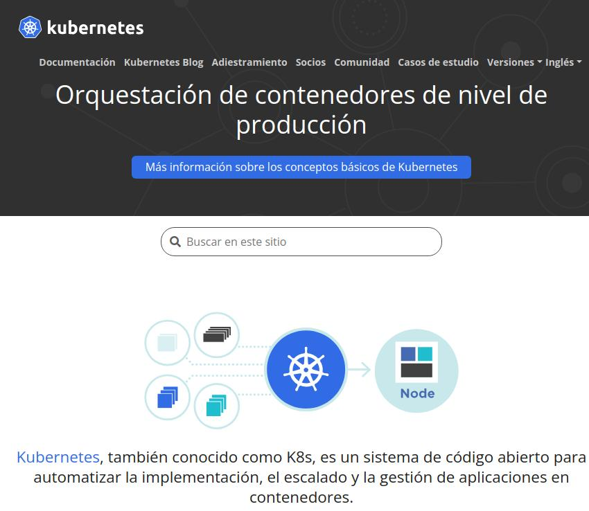

# Práctica 1: Explorando Kubernetes

## Objetivo de la práctica:

Al finalizar la práctica, serás capaz de:

- Explorar el sitio oficial de Kubernetes y entender los conceptos básicos.
- Investigar la documentación y casos de estudio de Kubernetes.
- Participar en la comunidad de Kubernetes y compartir tus aprendizajes.

## Objetivo visual:

A continuación, encontrarás una lista que resume las actividades a realizar durante la práctica, que abarcan desde la exploración del sitio web hasta la participación activa en la comunidad.

## Actividades a realizar:

**Tarea 1. Explorar el sitio oficial de Kubernetes.**

Paso 1. Visita el sitio web de Kubernetes.

[https://kubernetes.io/](https://kubernetes.io/)
   
Paso 2. Explora las secciones principales que se nombran a continuación:  

- Documentation  
- Blog  
- Community  
- Case Studies  
   
Paso 3. Lee *"What is Kubernetes?"* para comprender los conceptos básicos.

---

**Tarea 2. Leer la documentación de Kubernetes.**
   
Paso 1. Revisa la *"Quick Start Guide"* para obtener una visión general de cómo desplegar un clúster de Kubernetes.

Paso 2. Explora la sección *"Concepts"* para comprender los componentes fundamentales de Kubernetes, los cuales son:

- Pods
- Nodes
- Clusters
- Deployments

---

**Tarea 3. Investigar casos de estudio y explorar la comunidad.**
   
Paso 1. Investiga casos de estudio en la sección *"Case Studies"* del sitio oficial.

Paso 2. Visita la sección *"Community"* para unirte a foros, explorar eventos y grupos de usuarios.

---

**Tarea 4. Participar en la comunidad.**
   
Paso 1. Únete a foros o canales de *Slack* relacionados con Kubernetes.

Paso 2. Asiste a eventos como *KubeCon* o seminarios web relacionados con Kubernetes.

Paso 3. Comparte tu conocimiento en blogs o con compañeros para contribuir al conocimiento colectivo.

## Duración aproximada:

- 60 minutos.

## Tabla de ayuda:

| Elemento                  | Descripción                                                                                                                                                                                                        |
| ------------------------- | ------------------------------------------------------------------------------------------------------------------------------------------------------------------------------------------------------------------ |
| **Kubernetes**            | Plataforma de orquestación de contenedores, ideal para la gestión de aplicaciones en contenedores en producción.                                                                                                   |
| **Documentación Oficial** | El sitio web de Kubernetes proporciona guías, tutoriales y referencias sobre cómo configurar y utilizar Kubernetes. Se recomienda especialmente revisar las secciones "What is Kubernetes?" y "Quick Start Guide". |
| **Casos de Estudio**      | Sección que ofrece ejemplos reales de cómo organizaciones han implementado Kubernetes para resolver problemas. Ayuda a comprender su aplicabilidad en diferentes contextos.                                        |
| **Comunidad Kubernetes**  | Kubernetes tiene una comunidad activa, con foros, grupos locales y eventos como KubeCon. Participar en la comunidad permite aprender de experiencias compartidas y resolver dudas.                                 |

## Instrucciones:

### Tarea 1. Explorar el sitio oficial de Kubernetes.

Paso 1. Accede al sitio web oficial de Kubernetes: [https://kubernetes.io/](https://kubernetes.io/).

Paso 2. Dedica unos minutos para explorar las secciones más importantes, como lo son:

- "Documentation": Revisa guías y documentación oficial.
- "Blog": Lee artículos y noticias sobre Kubernetes.
- "Community": Información sobre cómo involucrarse con la comunidad.
- "Case Studies": Explora cómo diferentes organizaciones implementan Kubernetes.

### Tarea 2. Leer la documentación básica de Kubernetes.

Paso 1. Lee la sección *"What is Kubernetes?"* para obtener una comprensión general de los conceptos clave de Kubernetes, como sus beneficios y arquitectura.

Paso 2. Revisa la *"Quick Start Guide"* para familiarizarte con los pasos básicos para desplegar un clúster de Kubernetes en un entorno local o en la nube.

Paso 3. Explora la sección *"Concepts"* para aprender sobre los componentes fundamentales de Kubernetes, como: Pods, Nodes, Clusters y Deployments.

### Tarea 3. Investigar casos de estudio y explorar la comunidad.

Paso 1. Visita la sección *"Case Studies"* en el sitio web oficial de Kubernetes y elige al menos un caso de estudio que te interese. Lee cómo Kubernetes ha sido utilizado en diferentes sectores.

Paso 2. Dirígete a la sección *"Community"* y explora los diferentes canales disponibles para interactuar con la comunidad de Kubernetes, como foros, Slack, y eventos como KubeCon + CloudNativeCon.

Paso 3. Investiga diferentes formas de participar en la comunidad, ya sea unirte a un grupo de usuarios local, participar en foros de discusión o asistir a seminarios y meetups.

### Tarea 4. Participar en la comunidad de Kubernetes.

Paso 1. Únete a foros de discusión o canales de Slack relacionados con Kubernetes para resolver dudas y compartir experiencias.

Paso 2. Asiste a eventos o seminarios web relacionados con Kubernetes para aprender más y conectar con otros usuarios.

Paso 3. Comparte tus experiencias y aprendizajes clave con tus compañeros o en un blog personal. Documenta tu participación en la comunidad y cómo te ha ayudado a aprender más sobre Kubernetes.

## Resultado esperado:

El resultado esperado es que obtengas una comprensión básica de Kubernetes, aprendas cómo acceder a su documentación y cómo interactuar con su comunidad. Además, habrás investigado cómo las organizaciones están utilizando Kubernetes y estarás listo para contribuir al conocimiento colectivo.
