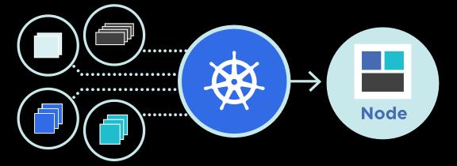

# Práctica 6. Configuración y gestión de Pod en Kubernetes

## Objetivo de la práctica:

Al finalizar esta práctica, serás capaz de:

- Crear un Pod básico en Kubernetes utilizando archivos YAML.
- Gestionar Pods mediante kubectl, incluyendo la creación, visualización de logs y eliminación.
- Utilizar Annotations para agregar metadatos a los Pods.
- Verificar el estado de los Pods en un clúster Kubernetes.

## Objetivo visual:

Aquí tendremos la creación del archivo YAML, la aplicación del Pod, los logs, la adición de anotaciones y la eliminación del Pod. Con comandos y sus respectivos resultados esperados.



## Duración aproximada:

- 60 minutos.

## Tabla de ayuda:

A continuación, se presenta una tabla con detalles útiles para la práctica, como los comandos más utilizados, IPs y versiones de software, que pueden ser necesarios durante la realización de la práctica.

| **Elemento**              | **Descripción**                                                 |
| ------------------------- | --------------------------------------------------------------- |
| **Comando kubectl**       | Herramienta para interactuar con el clúster de Kubernetes.      |
| **Versión de Kubernetes** | 1.24 o superior.                                                |
| **Archivo YAML**          | Define la configuración del Pod, como contenedor y puertos.     |
| **IP del servidor**       | Dirección IP del clúster o nodo donde se ejecuta Kubernetes.    |
| **Credenciales**          | Asegúrate de tener acceso a kubectl con privilegios necesarios. |
| **Logs del Pod**          | Uso de `kubectl logs <pod-name>` para ver los logs del Pod.     |

## Instrucciones:

### Tarea 1: Crear un Pod básico en Kubernetes.

Paso 1. **Crear un archivo YAML** que defina un Pod con el contenedor Nginx. El archivo debe llamarse `nginx-pod.yaml` y debe contener la siguiente estructura:

```yaml
apiVersion: v1
kind: Pod
metadata:
  name: nginx-pod
  annotations:
    description: "A simple nginx pod"
spec:
  containers:
  - name: nginx
    image: nginx:latest
    ports:
    - containerPort: 80
```

Paso 2. **Aplica el archivo YAML** usando el siguiente comando:

```bash
kubectl apply -f nginx-pod.yaml
```

Paso 3. **Verifica el estado del Pod** ejecutando el siguiente comando:

```bash
kubectl get pods
```

### Tarea 2. Acceder a los logs y agregar una anotación.

Paso 1. **Accede a los logs del Pod** con el siguiente comando:

```bash
kubectl logs nginx-pod
```

Paso 2. **Agrega una anotación al Pod** para modificar la descripción del Pod. Usa el siguiente comando:

```bash
kubectl annotate pod nginx-pod description="Updated description"
```

Paso 3. **Verifica que la anotación fue añadida correctamente** usando:

```bash
kubectl describe pod nginx-pod
```

### Tarea 3. Eliminar un Pod.

Paso 1. **Elimina el Pod** usando el siguiente comando:

```bash
kubectl delete pod nginx-pod
```

### Resultado esperado:

Al completar esta práctica, los estudiantes habrán logrado:

- Crear un Pod básico con un contenedor Nginx en Kubernetes.
- Aplicar configuraciones a través de un archivo YAML.
- Verificar el estado y los logs del Pod utilizando `kubectl`.
- Agregar anotaciones (Annotations) a un Pod.
- Eliminar el Pod creado en el clúster.

Al finalizar la práctica, habras gestionado eficazmente un Pod en Kubernetes, utilizando herramientas fundamentales para trabajar con un clúster Kubernetes.

## Información adicional y recomendaciones:

### Familiarización con el entorno:

Asegúrate de tener acceso a un entorno de Kubernetes donde puedas aplicar los comandos y verificar que todo funciona correctamente.

### Enlaces útiles:

- [Documentación oficial de Kubernetes](https://kubernetes.io/docs/home/)
- [Referencia sobre kubectl](https://kubernetes.io/docs/reference/kubectl/overview/)

### Sugerencia de revisión:

Revise cada paso en el entorno de Kubernetes y asegúrese de que el Pod se haya creado y gestionado correctamente utilizando los comandos proporcionados.

### Recomendaciones:

- Si el Pod no se crea, verifique el archivo YAML y asegúrese de que esté bien formateado.
- Si los logs no se muestran correctamente, asegúrese de que el contenedor se esté ejecutando sin problemas.

### Explicaciones clave:

- Se ha estructurado la práctica en tareas claras y secuenciales, desde la creación del Pod hasta su eliminación.
- La información proporcionada en las tablas y recomendaciones asegura que los estudiantes cuenten con toda la información relevante para trabajar con Kubernetes.
- El uso de los comandos de `kubectl` es detallado, explicando cómo aplicar, verificar logs y eliminar Pods.
