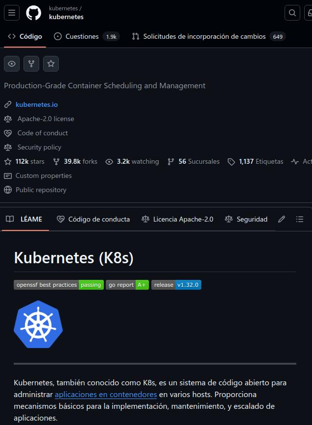

# Práctica 2. Repositorio Oficial de Kubernetes

## Objetivo de la práctica
Al finalizar esta práctica, los estudiantes serán capaces de:
- Conocer el repositorio GitHub oficial de Kubernetes.
- Entender la estructura de un repositorio de código abierto en GitHub.
- Aprender a navegar y explorar el código, problemas y otras secciones clave de Kubernetes en GitHub.

## Descripción de la práctica
En este apartado, los estudiantes deben comprender y ver cómo interactuar con el repositorio de Kubernetes en GitHub. A continuación, se describen las secciones clave del repositorio:

1. **Sección de código**: El área donde se encuentra el código fuente del proyecto Kubernetes.
2. **Sección de Issues (Problemas)**: Donde los usuarios pueden reportar errores, sugerir nuevas características o discutir problemas.
3. **Pull Requests**: Permite visualizar las propuestas de cambios al código.
4. **Acciones**: Muestra los flujos de trabajo automatizados para CI/CD.
5. **Proyectos y seguridad**: Información relacionada con la planificación de proyectos y medidas de seguridad implementadas en el repositorio.

## Duración aproximada:
- 15 minutos.

## Información útil
A continuación, se presenta una tabla con la información clave que los estudiantes pueden necesitar para llevar a cabo la práctica de forma efectiva:

| Recurso                  | Descripción                                                                                 |
|--------------------------|---------------------------------------------------------------------------------------------|
| **Repositorio GitHub**    | URL: [https://github.com/kubernetes/kubernetes](https://github.com/kubernetes/kubernetes)    |
| **Rama principal**        | Master - La rama donde se encuentra el código más actualizado del proyecto.                |
| **Archivos importantes**  | `.github`, `CHANGELOG`, `LICENSES`, `api`, `hack` son algunas de las carpetas importantes. |
| **Licencia**              | Apache 2.0 - La licencia bajo la cual se distribuye Kubernetes.                              |
| **Número de commits**     | 117,059 commits, lo que refleja el desarrollo activo del proyecto.                         |
| **Número de etiquetas**   | 1126 etiquetas que corresponden a versiones y puntos importantes del código.                |

## Instrucciones

### Tarea 1. Acceder al repositorio GitHub de Kubernetes
Paso 1. Accede a la URL del repositorio: [https://github.com/kubernetes/kubernetes](https://github.com/kubernetes/kubernetes).

Paso 2. Familiarízate con las secciones principales del repositorio: 
   - **Code**: Explora las carpetas y archivos principales del proyecto.
   - **Issues**: Revisa los problemas reportados y cómo se gestionan.
   - **Pull requests**: Observa cómo se gestionan las contribuciones al proyecto.

Paso 3. Revisa el **README.md** del repositorio para obtener información adicional sobre el proyecto y cómo contribuir.

### Tarea 2. Explorar el historial de cambios y ramas
Paso 1. Dirígete a la sección de **Commits** y observa los mensajes de cambios recientes realizados en el proyecto.

Paso 2. Examina las **Ramas** y cómo el código se organiza en distintas versiones de desarrollo.

Paso 3. Consulta la sección de **Tags** para entender las versiones de lanzamiento del proyecto.

### Resultado esperado
Al finalizar la práctica, los estudiantes deberían ser capaces de:
- Navegar por el repositorio oficial de Kubernetes en GitHub.
- Comprender las secciones clave del repositorio como Issues, Pull Requests y la estructura de ramas.
- Tener una visión clara de cómo Kubernetes gestiona el código y las contribuciones.

