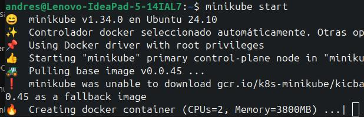
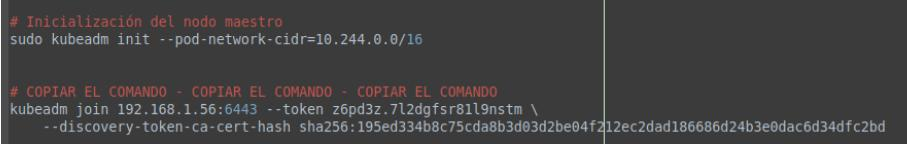

# Introducción y Configuración de Minikube para la Gestión de Clústeres Kubernetes Locales

## Objetivo de la práctica

Al finalizar esta práctica, los estudiantes serán capaces de:

- Comprender los conceptos fundamentales de Kubernetes y Minikube.
- Instalar y configurar Minikube en su máquina local.
- Ejecutar un clúster de Kubernetes utilizando Minikube y comprobar su funcionamiento.
- Desplegar aplicaciones en un clúster de Minikube y verificar su estado.

---

## Actividades Visuales

Para apoyar las actividades realizadas, aquí se presenta un diagrama o estructura de pasos que guía a los estudiantes en la práctica de Minikube.

---

## Duración aproximada

- 60 minutos.

---

## Ayuda adicional

Esta sección proporciona información útil que podrás necesitar durante el laboratorio, como comandos, configuraciones y enlaces importantes:

| Elemento | Descripción |
| --- | --- |
| **Versión de Minikube** | Utiliza la versión más reciente compatible con tu sistema operativo. Asegúrate de que Minikube esté actualizado. |
| **Requisitos previos** | Verifica que tu máquina tenga al menos 4 GB de RAM y 2 CPUs para ejecutar Minikube sin problemas. |
| **Enlace a la documentación** | [Documentación oficial de Minikube](https://minikube.sigs.k8s.io/docs/) |
| **Comando para verificar la versión de Minikube** | `minikube version` |
| **Comando para iniciar Minikube** | `minikube start` |
| **Comando para comprobar el estado de Minikube** | `minikube status` |

---

## Instrucciones

### Tarea 1: Preparación del entorno

Paso 1. **Instalar Minikube**:  
Descarga e instala Minikube según el sistema operativo que estés utilizando. Asegúrate de seguir las instrucciones específicas para tu plataforma.

Paso 2. **Iniciar Minikube**:  
Una vez instalado, abre la terminal y ejecuta el comando `minikube start` para iniciar tu clúster local de Kubernetes. Esto descargará las imágenes necesarias y configurará tu clúster.

Paso 3. **Verificar el estado**:  
Usa el comando `minikube status` para asegurarte de que Minikube se ha iniciado correctamente. La salida debe indicar que los componentes están en ejecución.

### Tarea 2: Desplegar una aplicación en Minikube

Paso 1. **Desplegar una aplicación sencilla**:  
Utiliza el comando `kubectl create deployment hello-minikube --image=k8s.gcr.io/echoserver:1.10` para desplegar una aplicación simple que servirá como ejemplo para comprobar que el clúster funciona correctamente.

Paso 2. **Exponer la aplicación**:  
Ejecuta el comando `kubectl expose deployment hello-minikube --type=NodePort --port=8080` para exponer la aplicación en un puerto accesible.

Paso 3. **Acceder a la aplicación**:  
Usa el comando `minikube service hello-minikube` para abrir una ventana del navegador que te permitirá ver la aplicación en funcionamiento.

---

## Resultado esperado

Al finalizar la práctica, deberías ser capaz de:

- Tener un clúster de Kubernetes.
- Tener corriendo localmente un Minikube.
- Desplegar y exponer una aplicación dentro de este clúster.
- Ver y acceder a la aplicación desplegada a través del navegador.

